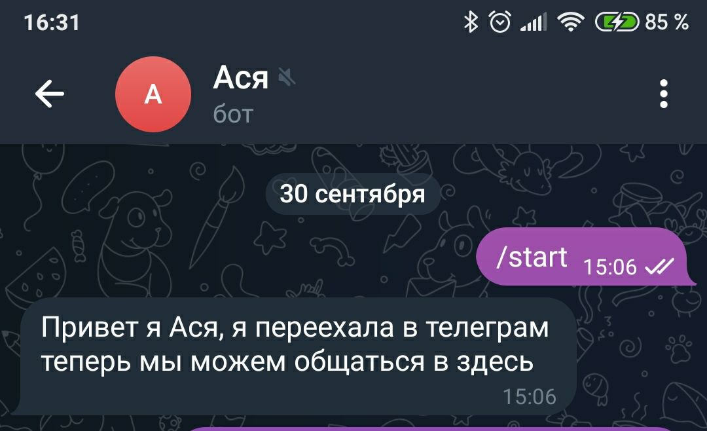
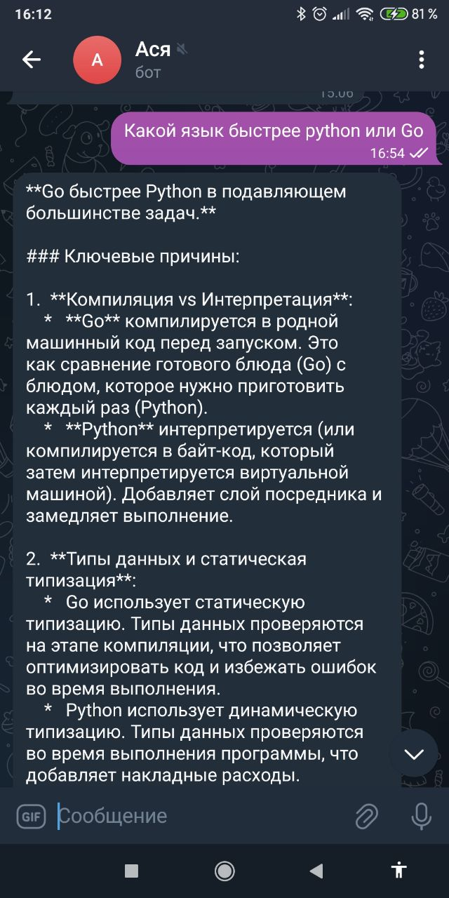
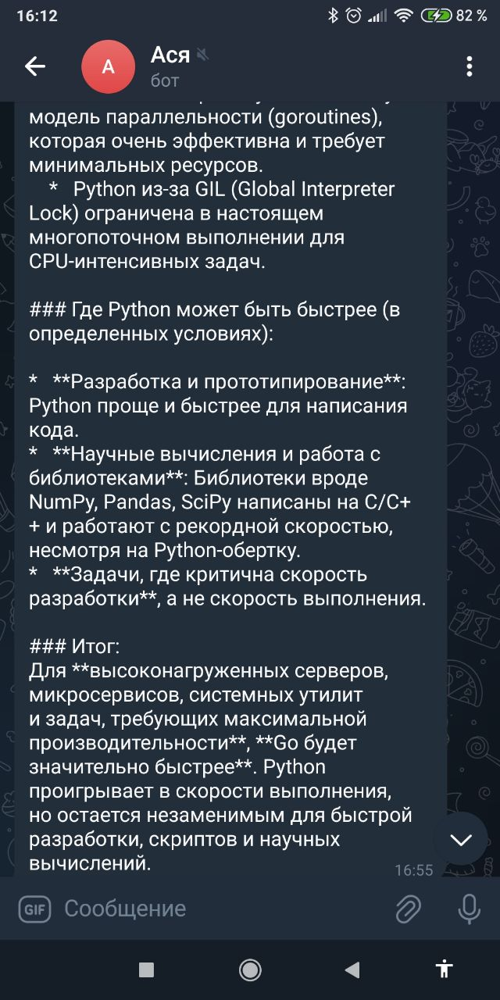
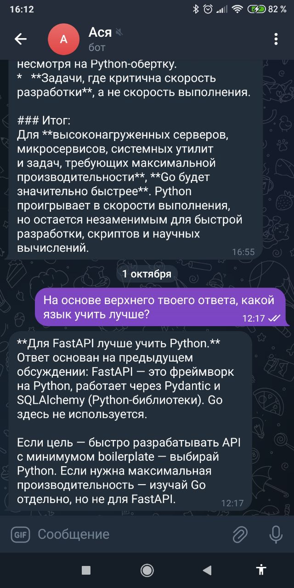
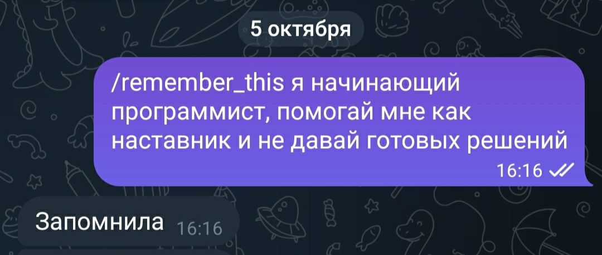
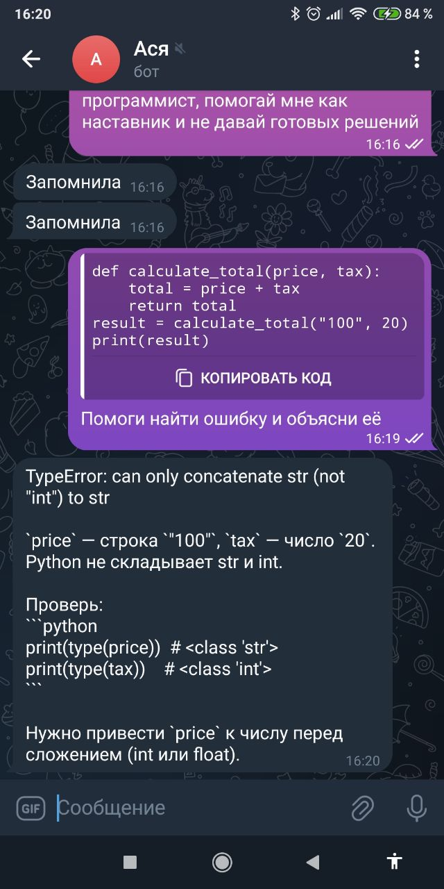
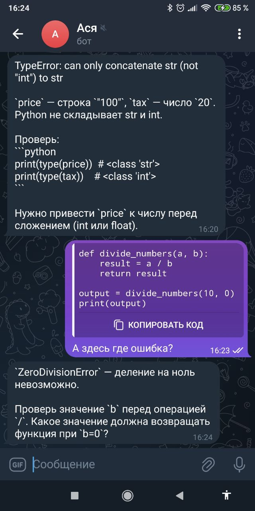
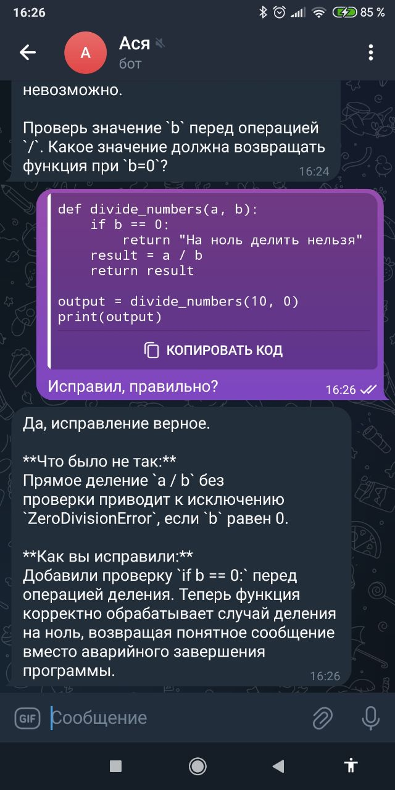

## Личный ИИ-бот в Telegram

Telegram-бот на aiogram, с долгой и короткой памятью. Общение происходит через polling, 
FastAPI используется только для управления async-подключением к БД.

## Возможности

- Обычный диалог с ИИ (через OpenRouter)
- Короткая память: последние 30 сообщений переписки хранятся в БД 
  и передаются модели как контекст
- Долгая память: команда `/remember_this` сохраняет факты, которые 
  подмешиваются в системный промпт на каждый запрос
- Доступ только у меня(проверка по Telegram ID)

## Стек

- Python 3.12, aiogram 3
- FastAPI + SQLAlchemy (async) — только для подключения к БД
- PostgreSQL
- OpenRouter API (через `openai` SDK)
- Alembic, 
- Docker, Docker Compose
## Структура БД

- `chat_history` — вся история переписки (role, content, created_at)
- `long_memory` — факты долгой памяти (category, fact, updated_at)

## Пример работы

Сообщение в Telegram -> бот -> запись в БД -> запрос к LLM с историей и долгосрочной памятью -> ответ пользователю. 

## Команды

 `/start` -  Приветствие 
 `/remember_this <текст>` - Сохранить факт в долгую память 

## Переменные окружения 
(`.env`)

## Демо
        
